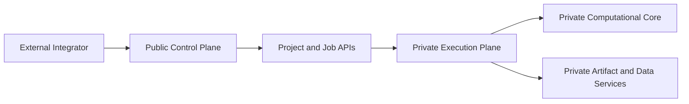

# Control Plane and Data Plane

## Control plane

The public control plane is the contract-facing layer responsible for:

- authentication
- project lifecycle control
- job submission
- status retrieval
- callback registration

## Data plane

The private execution plane is responsible for:

- task execution
- artifact generation
- internal data movement
- model and kernel invocation

## Boundary rule

External consumers interact with the control plane only.

The data plane remains private and is represented publicly through stable contract objects and artifact references.
