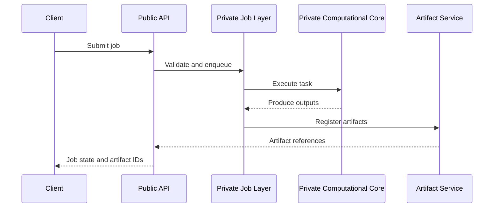

# Inference Flow

```mermaid
sequenceDiagram
    participant Client
    participant API as Public API
    participant Jobs as Private Job Layer
    participant Core as Private Computational Core
    participant Artifacts as Artifact Service

    Client->>API: Submit job
    API->>Jobs: Validate and enqueue
    Jobs->>Core: Execute task
    Core-->>Jobs: Produce outputs
    Jobs->>Artifacts: Register artifacts
    Artifacts-->>API: Artifact references
    API-->>Client: Job state and artifact IDs
```
