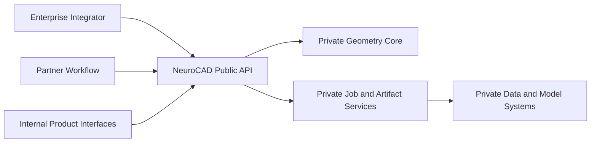

# System Context

```mermaid
flowchart LR
    A[Enterprise Integrator] --> B[NeuroCAD Public API]
    C[Partner Workflow] --> B
    D[Internal Product Interfaces] --> B
    B --> E[Private Geometry Core]
    B --> F[Private Job and Artifact Services]
    F --> G[Private Data and Model Systems]
```

## Interpretation

The public contract layer is the shared boundary between external systems and the private NeuroCAD computational stack.
