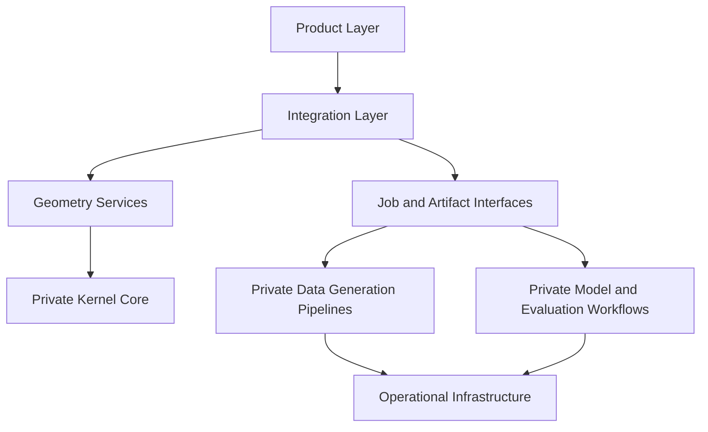

# System Overview

## Public architecture view

NeuroCAD is operated as a full engineering platform with a public integration surface and a proprietary computational core.

## Layer definitions

### Product layer

This is the platform-facing layer used by customers, partners, and internal operators.

Typical responsibilities:

- project lifecycle
- access control
- user-facing workflows
- enterprise integration entry points

### Integration layer

This is the public machine-facing contract layer.

Typical responsibilities:

- authentication
- project APIs
- job submission
- artifact resolution
- callback and event integration

### Geometry services

This layer exposes geometry-adjacent capabilities through controlled interfaces without exposing internal computational implementation.

### Private kernel core

This layer remains proprietary.

It contains the implementation details that define NeuroCAD's internal computational advantage.

### Private data generation pipelines

This layer remains proprietary.

It covers internal data generation workflows, packaging systems, and related orchestration.

### Private model and evaluation workflows

This layer remains proprietary.

It covers model training, evaluation infrastructure, and internal experiment surfaces.

### Operational infrastructure

This layer remains proprietary.

It includes deployment, orchestration, storage, and platform operations.

## Public versus proprietary boundary

The public side should be inspectable and stable enough for integration and diligence.

The private side should remain protected as implementation IP.
